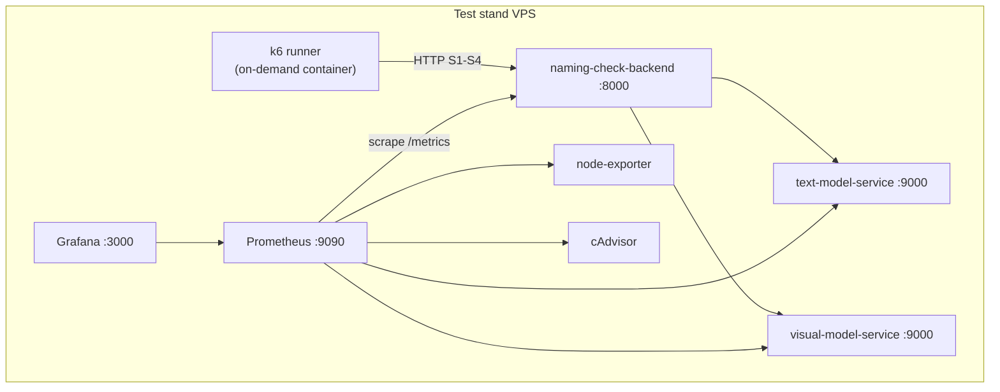

# Тестовое окружение для нагрузочного тестирования

> **Задача:** [#74 — Подготовить инфраструктуру для нагрузочного тестирования](https://github.com/Naming-Checker/Backend/issues/74)  
> **Критерий приёмки:** подготовлено тестовое окружение  
> **Связанные документы:** [load_testing_goals.md](load_testing_goals.md)

## 1. Назначение

Тестовое окружение для нагрузочного тестирования — это **изолированный test stand** (VPS), на котором развёрнуты backend, ML sidecars и monitoring stack. Нагрузка **не направляется** на production (целевая прод-среда МТС ещё не развёрнута; все прогоны идут только на test stand).

Цели окружения:

- безопасно генерировать нагрузку без влияния на будущий production;
- иметь те же сервисы, что и на стенде: `naming-check-backend`, `visual-model-service`, `text-model-service`;
- собирать метрики через уже развёрнутый Prometheus/Grafana;
- запускать k6 из Docker на том же хосте, что и приложение.

## 2. Архитектура



| Компонент | Путь / порт | Роль |
|-----------|-------------|------|
| Backend API | `:8000` (публично на стенде) | Цель нагрузки S1–S4 |
| k6 runner | `infra/load-testing/` | Генератор нагрузки |
| Prometheus | `127.0.0.1:9090` | Метрики приложения и инфраструктуры |
| Grafana | `:3000` | Визуализация во время теста |
| Docker network | `naming-check-net` | Общая сеть app + monitoring + k6 |

## 3. Предварительные требования

### На test stand (после `deploy-test-stand` workflow)

1. Контейнеры `naming-check-backend`, `visual-model-service`, `text-model-service` в статусе **healthy**.
2. Monitoring stack запущен (`infra/monitoring/.env.monitoring` с `GRAFANA_ADMIN_PASSWORD`).
3. ML-артефакты смонтированы (`/opt/text-model-models`, `/opt/visual-model-models`).
4. Порты **8000** (API) и **3000** (Grafana) открыты для команды.

### Локально (опционально)

- Docker
- Запущенные backend + sidecars (см. `README.md`, smoke-скрипты)
- `LOAD_TEST_BASE_URL=http://127.0.0.1:8000`

## 4. Быстрый старт

### Шаг 1. Подготовка окружения

На сервере test stand:

```bash
cd /opt/naming-check-backend
bash scripts/load/prepare-load-test-env.sh
```

Скрипт:

- создаёт `infra/load-testing/.env.load` из example (если нет);
- проверяет Docker network `naming-check-net`;
- скачивает образ `grafana/k6`;
- запускает pre-flight проверки (`verify-load-test-ready.sh`).

### Шаг 2. Проверка готовности

```bash
bash scripts/load/verify-load-test-ready.sh
```

Проверяется:

- `LOAD_TEST_BASE_URL` в allowlist (`LOAD_TEST_ALLOWED_HOSTS`);
- `GET /api/v1/health`;
- `POST /api/v1/text-similarity/search`;
- наличие контейнеров и monitoring (если доступны).

### Шаг 3. Запуск профиля (smoke / baseline / stress)

```bash
# smoke
PROFILE=smoke bash scripts/load/run-load-test.sh

# baseline (дефолт: 1 VU, 10m)
PROFILE=baseline bash scripts/load/run-load-test.sh

# stress (дефолтные stages 5→15→30 VU)
PROFILE=stress bash scripts/load/run-load-test.sh
```

Краткие make-цели:

```bash
make load-test-smoke
make load-test-baseline
make load-test-stress
```

Сценарии используют mixed-поток S1–S4 с весами по умолчанию 60/25/10/5.

## 5. Конфигурация

Файл: [`infra/load-testing/.env.load.example`](../infra/load-testing/.env.load.example)

| Переменная | Описание | Значение по умолчанию (test stand) |
|------------|----------|-------------------------------------|
| `LOAD_TEST_BASE_URL` | URL backend API | `http://naming-check-backend:8000` |
| `LOAD_TEST_ALLOWED_HOSTS` | Allowlist хостов | `localhost,127.0.0.1,naming-check-backend` |
| `LOAD_TEST_PROFILE` | Профиль (`smoke`/`baseline`/`stress`) | `smoke` |
| `LOAD_TEST_VUS` | Количество пользователей (для smoke/baseline) | `1` |
| `LOAD_TEST_DURATION` | Длительность прогона | `30s` |
| `LOAD_TEST_RPS` | Целевой RPS (если >0, smoke/baseline = constant-arrival-rate) | `0` |
| `LOAD_TEST_STAGES` | Stages для stress (`4m:5,6m:15,...`) | из сценария |
| `LOAD_TEST_S1_WEIGHT..S4_WEIGHT` | Веса mixed S1/S2/S3/S4 | `60/25/10/5` |
| `PROMETHEUS_URL` | Для оператора | `http://127.0.0.1:9090` |
| `GRAFANA_URL` | Для оператора | `http://127.0.0.1:3000` |
| `K6_OUT` | Доп. вывод k6 (JSON, InfluxDB) | пусто |

### Запуск с ноутбука против публичного стенда

```bash
# infra/load-testing/.env.load
LOAD_TEST_BASE_URL=http://<TEST_STAND_HOST>:8000
LOAD_TEST_ALLOWED_HOSTS=localhost,127.0.0.1,naming-check-backend,<TEST_STAND_HOST>
GRAFANA_URL=http://<TEST_STAND_HOST>:3000
```

> Добавьте IP/hostname стенда в `LOAD_TEST_ALLOWED_HOSTS` — это защита от случайного запуска против чужого URL.

## 6. Безопасность и изоляция

| Правило | Реализация |
|---------|------------|
| Только test stand | Allowlist хостов в `verify-load-test-ready.sh` |
| Нет auto-start k6 | Compose profile `load-test`, контейнер только по `docker compose run` |
| Sidecars не публичны | Порты 9000/9100 на `127.0.0.1` хоста |
| Stage 2 не stress-тестится | См. [load_testing_goals.md §2.3](load_testing_goals.md) |
| Production | Не существует в текущей итерации; при появлении — отдельный allowlist |

## 7. Структура файлов

```
backend/
├── infra/load-testing/
│   ├── docker-compose.load-testing.yml   # k6 runner
│   ├── .env.load.example                 # шаблон конфигурации
│   └── k6/
│       ├── scripts/smoke.js              # smoke mixed S1–S4
│       ├── scripts/baseline.js           # baseline mixed S1–S4
│       ├── scripts/stress.js             # stress mixed S1–S4
│       ├── scripts/lib/                  # общий код конфигурации/flows/summary
│       └── data/                         # queries.json + sample-logo.png
├── scripts/load/
│   ├── prepare-load-test-env.sh          # подготовка окружения
│   ├── verify-load-test-ready.sh         # pre-flight
│   ├── verify-metrics-collection.sh      # pre-flight метрик
│   ├── export-load-test-summary.sh       # экспорт отчёта из Prometheus
│   ├── run-load-test.sh                 # универсальный runner профилей
│   └── run-smoke-load-test.sh            # обёртка для smoke
└── docs/performance/
    ├── load_testing_goals.md
    ├── load_test_environment.md          # этот документ
    ├── load_test_report_template.md      # шаблон + инструкция
    └── reports/                          # сгенерированные отчёты
```

## 8. Проверка критерия приёмки (#74)

### Окружение (п.2)

- [ ] `prepare-load-test-env.sh` завершается без ошибок на test stand
- [ ] `verify-load-test-ready.sh` показывает `Environment ready`
- [ ] `run-smoke-load-test.sh` выводит `Smoke load test: PASS`

### Метрики (п.3)

- [ ] `verify-metrics-collection.sh` → `Metrics collection: READY`
- [ ] Prometheus scrape: `up{job=~"naming-check-backend|..."} == 1`
- [ ] Recording rules: `naming_check:load_test:*` появляются после трафика

Документация: [`infra/monitoring/docs/metrics_collection.md`](../infra/monitoring/docs/metrics_collection.md)

### Grafana (п.4)

- [ ] Дашборд **Load Testing** в папке Naming Check
- [ ] Во время smoke/трафика обновляются RPS, latency p95/p99, error rate, CPU/RAM
- [ ] Панель DB показывает статус «planned» (MVP — N/A)

## 9. Troubleshooting

| Симптом | Действие |
|---------|----------|
| `Host not in allowlist` | Добавить хост в `LOAD_TEST_ALLOWED_HOSTS` |
| `text similarity failed` | Дождаться warm-up sidecars (~5–10 мин после deploy): `docker logs text-model-service` |
| `naming-check-net missing` | `docker network create naming-check-net` |
| Grafana пустая | Подождать 30 с после smoke; `bash scripts/load/verify-metrics-collection.sh` |
| Recording rules NO DATA | Подождать 30 с после трафика; перезапустить Prometheus: `docker restart prometheus` |
| k6 cannot resolve naming-check-backend | Запускать k6 **на сервере стенда**, не с ноутбука без override URL |

## 10. Статус задачи #74

| Критерий | Статус |
|----------|--------|
| Инструмент (k6) | ✅ `infra/load-testing/docker-compose.load-testing.yml` |
| Тестовое окружение | ✅ `scripts/load/prepare-load-test-env.sh` |
| Сбор метрик | ✅ Prometheus + recording rules + `verify-metrics-collection.sh` |
| Grafana dashboards | ✅ `load-testing.json` + ссылки из Overview/Services/Infrastructure |
| Сценарии нагрузки | ✅ #75: smoke / baseline / stress, mixed S1–S4 |

**Definition of Done (#74):** команда запускает smoke-тест и видит основные метрики на дашборде **Load Testing**.


## 11. CI/CD запуск сценариев (#75)

Ручной запуск через GitHub Actions:

- Workflow: `.github/workflows/load-test.yml`
- Trigger: `workflow_dispatch`
- Inputs: `profile`, `duration` (опц.), `vus` (опц.), `rps` (опц.)

Этот workflow предназначен для повторяемого запуска против test stand без автозапуска в PR.
