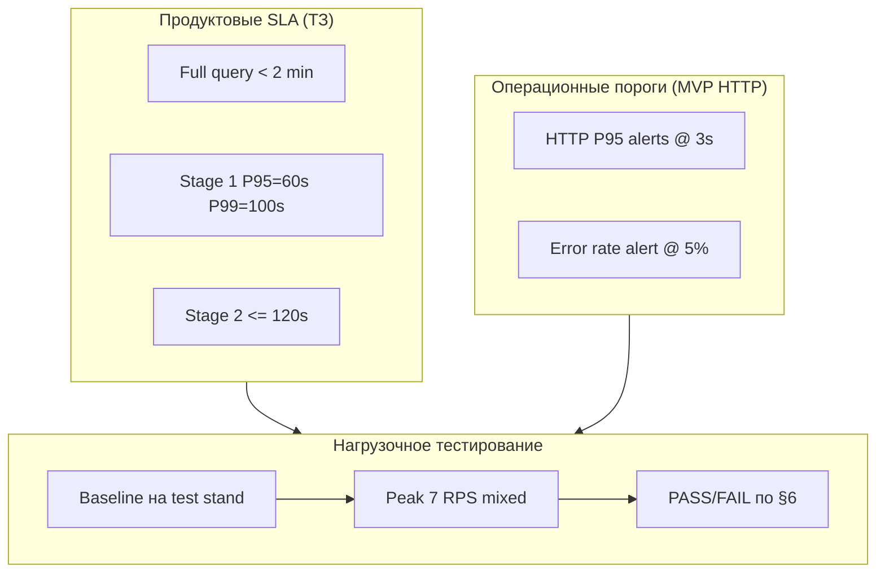

# Цели и ключевые метрики нагрузочного тестирования

> **Задача:** [#73 — Определить цели и ключевые метрики нагрузочного тестирования](https://github.com/Naming-Checker/Backend/issues/73)  
> **Статус:** Согласован
> **Версия:** 1.0  
> **Дата:** 2026-07-09

## 1. Назначение документа

Документ фиксирует:

- критические пользовательские сценарии для нагрузочного тестирования;
- целевые SLA/SLO и измеряемые метрики;
- пороги допустимой деградации;
- критерии успешного прохождения нагрузочного теста.

Документ согласован с продуктовыми требованиями ([`Documentation/requirements.md`](../../../Documentation/requirements.md)), планом качества ([`Documentation/quality_plan.md`](../../../Documentation/quality_plan.md)) и операционным мониторингом ([`infra/monitoring/`](../infra/monitoring/)).

---

## 2. Область и окружения

### 2.1. Что тестируем

| Уровень | Описание | Статус |
|---------|----------|--------|
| **MVP (текущий стенд)** | Прокси similarity API: текстовый и логотипный поиск, health, preview | Реализовано |
| **Целевой продукт** | Registration check, text infringement, logo comparison, async Stage 2 | В разработке |

### 2.2. Окружения нагрузочного тестирования

| Окружение | Назначение | Железо | Примечание |
|-----------|------------|--------|------------|
| **Test stand (VPS)** | Baseline, smoke load, регрессия перед релизом | CPU-only, 3 Docker-контейнера | Текущий CI/CD-стенд |
| **Target (A100)** | Целевые продуктовые SLA, capacity planning | NVIDIA A100 PCIe 80GB | Целевая прод-среда МТС |

> **Важно:** на MVP нет PostgreSQL/ClickHouse — нагрузка на БД фиксируется как **N/A** до внедрения persistence-слоя. Метрики БД включены в документ для целевого продукта.

### 2.3. Что не нагружаем высоким RPS

- **Stage 2 scraping** (`/api/v1/webhooks/stage2-results/*`) — Playwright, внешние источники, таймаут 60 с на источник. Допускается только **функциональная** и **ограниченная** нагрузка (1–3 параллельных job), не stress-тест.
- **Внешний интернет** — в целевой прод-среде запрещён в runtime; нагрузочные тесты Stage 2 выполняются с моками или на изолированном стенде.

---

## 3. Ключевые сценарии нагрузки

### 3.1. Сценарии MVP (приоритет 1 — тестировать сейчас)

| ID | Сценарий | Эндпоинт | Профиль нагрузки | Доля трафика |
|----|----------|----------|------------------|--------------|
| **S1** | Текстовый поиск схожих неймингов | `POST /api/v1/text-similarity/search` | Синхронный, CPU inference (ruBERT) | **60%** |
| **S2** | Поиск похожих логотипов | `POST /api/v1/logo-similarity/search` | Синхронный, multipart upload, VGG16 | **25%** |
| **S3** | Превью логотипов в UI | `GET /api/v1/logo-similarity/preview` | Лёгкий I/O, вызывается после S2 | **10%** |
| **S4** | Health / readiness | `GET /api/v1/health` | Фоновые пробы (blackbox, k8s) | **5%** |

**Типичный пользовательский поток (юрист):**

1. Вводит нейминг + классы МКТУ → S1.
2. При необходимости загружает логотип → S2 → несколько запросов S3 для превью результатов.
3. Health-пробы работают параллельно (S4).

### 3.2. Сценарии целевого продукта (приоритет 2 — после реализации API)

| ID | Сценарий | Эндпоинт | Профиль |
|----|----------|----------|---------|
| **S5** | Проверка регистрации (top-200) | `POST /api/v1/registration-check` | Тяжёлый: prefilter + multi-metric ranking |
| **S6** | Парное сравнение текстов | `POST /api/v1/text-infringement` | Средний: один кандидат |
| **S7** | Сравнение логотипов | `POST /api/v1/logo-comparison` | Тяжёлый: visual inference |
| **S8** | Async Stage 2 (webhook delivery) | webhook callback | Асинхронный, SLA ≤ 120 с |

### 3.3. Профили нагрузки (load patterns)

| Профиль | Описание | Длительность | Цель |
|---------|----------|--------------|------|
| **Baseline** | 1 VU, стабильный RPS | 10 мин | Эталон latency без конкуренции |
| **Normal load** | Ожидаемая рабочая нагрузка | 15 мин | Проверка SLO в штатном режиме |
| **Peak load** | Пик (конец рабочего дня, демо) | 10 мин | Запас по capacity |
| **Stress** | Постепенный рост до отказа | 20 мин | Найти точку деградации и bottleneck |
| **Soak** | Умеренная нагрузка | 60 мин | Утечки памяти, стабильность |

---

## 4. Целевые метрики

### 4.1. Продуктовые SLA (из ТЗ)

Источник: [`Documentation/requirements.md`](../../../Documentation/requirements.md), [`system_analysis/docs/project_context.md`](../../../system_analysis/docs/project_context.md).

| Метрика | Целевое значение | Область |
|---------|------------------|---------|
| Полный запрос end-to-end | **< 2 мин** | S5 + S8 (целевой продукт) |
| Stage 1 internal response | **P95 ≤ 60 с**, **P99 ≤ 100 с** | Внутренний ответ до Stage 2 |
| Stage 2 delivery | **SLA ≤ 120 с** | Доставка внешних результатов |
| Доступность | **99.5% – 99.9%** | Все публичные эндпоинты |

### 4.2. Операционные HTTP-метрики (MVP similarity API)

Для синхронных ручек S1–S3 на тестовом стенде и целевом A100:

| Метрика | Test stand (CPU) | Target (A100) | Источник |
|---------|------------------|---------------|----------|
| **RPS** (устойчивый) | см. §4.4 | см. §4.4 | Prometheus `http_requests_total` |
| **Latency P50** | ≤ 2 с (S1), ≤ 5 с (S2) | ≤ 0.5 с (S1), ≤ 2 с (S2) | `http_request_duration_seconds` |
| **Latency P95** | ≤ 10 с (S1), ≤ 30 с (S2) | ≤ 3 с (S1), ≤ 10 с (S2) | Grafana dashboard `services-metrics` |
| **Latency P99** | ≤ 30 с (S1), ≤ 60 с (S2) | ≤ 5 с (S1), ≤ 20 с (S2) | то же |
| **Error rate** (4xx+5xx) | **< 1%** | **< 0.5%** | `http_requests_total{status=~"4xx\|5xx"}` |

> Операционные алерты на стенде уже настроены: P95 > **3 с** и error rate > **5%** ([`alerts.yml`](../infra/monitoring/prometheus/alerts.yml)). Для MVP similarity на CPU пороги в таблице выше **мягче** алертов — это осознанное разделение «продуктовый SLA» vs «операционный алерт на деградацию».

### 4.3. Метрики утилизации ресурсов

| Метрика | Норма (normal load) | Предупреждение | Критично | Источник |
|---------|---------------------|----------------|----------|----------|
| **CPU хоста** | < 70% | 70–90% | **> 90%** (10 мин) | `node_cpu_seconds_total`, alert `HostHighCPU` |
| **RAM хоста** | < 75% | 75–90% | **> 90%** (5 мин) | `node_memory_*`, alert `HostHighMemory` |
| **CPU контейнера** (backend / sidecars) | < 80% лимита | 80–95% | **> 95%** | cAdvisor |
| **RAM контейнера** | без роста на soak | рост > 10% за 60 мин | OOM / restart | cAdvisor, Docker events |
| **Disk free** | > 30% | 15–30% | **< 15%** | alert `HostDiskLow` |

### 4.4. Целевой RPS по сценариям

Оценка для **внутреннего** сервиса (десятки юристов, не публичный API):

| Сценарий | Normal load | Peak load | Stress (max до деградации) |
|----------|-------------|-----------|----------------------------|
| S1 text search | **2 RPS** | **5 RPS** | определить экспериментально |
| S2 logo search | **0.5 RPS** | **1 RPS** | определить экспериментально |
| S3 preview | **5 RPS** | **10 RPS** | определить экспериментально |
| S4 health | **1 RPS** | **2 RPS** | — |
| **Суммарно (mixed)** | **~3 RPS** | **~7 RPS** | — |

**Concurrent users (VU):** normal — **5**, peak — **15**, stress — ramp 5 → 30.

> Конкретные RPS уточняются после первого baseline-прогона на test stand и фиксируются в отчёте о нагрузочном тестировании.

### 4.5. Метрики нагрузки на БД (целевой продукт)

Применимо после внедрения PostgreSQL + ClickHouse:

| Метрика | Normal load | Порог деградации |
|---------|-------------|------------------|
| PostgreSQL: active connections | < 50% pool size | > 80% pool size |
| PostgreSQL: query latency P95 | < 100 ms (metadata) | > 500 ms |
| ClickHouse: query latency P95 (vector search) | < 2 с | > 10 с |
| ClickHouse: CPU | < 70% | > 90% |
| Replication / insert lag | < 5 с | > 30 с |

На MVP: **N/A** — фиксировать в отчёте как «не тестировалось».

---

## 5. Пороги допустимой деградации

Сервис считается **деградировавшим**, если выполняется **любое** из условий:

| # | Условие | Окно наблюдения |
|---|---------|-----------------|
| D1 | Error rate (5xx) **> 1%** | 5 мин |
| D2 | Error rate (4xx validation) **> 5%** при валидных данных теста | 5 мин |
| D3 | P95 latency S1 **> 2×** от baseline | 5 мин |
| D4 | P95 latency S2 **> 2×** от baseline | 5 мин |
| D5 | CPU хоста **> 90%** | 10 мин |
| D6 | RAM хоста **> 90%** | 5 мин |
| D7 | Любой из 3 сервисов недоступен (`up == 0` или probe failed) | 2 мин |
| D8 | `service_health_status == 0` (модель не загружена) | 5 мин |
| D9 | Рост памяти контейнера **> 20%** на soak без стабилизации | 60 мин |

**Полный отказ (fail):** D7, D8, или error rate 5xx **> 5%** в течение 5 мин.

---

## 6. Критерии успешного нагрузочного теста

Тест **пройден (PASS)**, если для выбранного профиля (baseline / normal / peak / soak):

| # | Критерий | Обязательность |
|---|----------|----------------|
| P1 | Все сценарии S1–S4 отрабатывают с **error rate < 1%** (5xx) | Обязательно |
| P2 | Latency P95 и P99 **не превышают** значения из §4.2 | Обязательно |
| P3 | RPS достигает целевого значения из §4.4 **без** срабатывания условий §5 | Обязательно |
| P4 | CPU и RAM **не входят** в критические пороги (§4.3) | Обязательно |
| P5 | После soak (60 мин) нет OOM, restart контейнеров, утечки памяти > 20% | Для soak-профиля |
| P6 | Grafana dashboards и Prometheus метрики собираются без пробелов | Обязательно |
| P7 | Результаты задокументированы: RPS, p50/p95/p99, error rate, CPU/RAM, выводы | Обязательно |

Тест **не пройден (FAIL)**, если нарушен любой обязательный критерий или сработало условие «полный отказ» из §5.

---

## 7. Инструментарий и артефакты

| Компонент | Назначение |
|-----------|------------|
| **k6** (рекомендуется) или **Locust** | Генерация нагрузки, сценарии S1–S4 |
| **Prometheus + Grafana** | Сбор метрик во время теста (`infra/monitoring/`) |
| **ELK / Kibana** | Анализ медленных запросов (> 3 с) |
| `scripts/generate-monitoring-traffic.sh` | Лёгкий smoke-трафик (не замена load test) |

**Артефакты после прогона:**

1. Отчёт: дата, окружение, профиль, версия образа (git SHA).
2. Таблица метрик: RPS, p50/p95/p99, error rate, CPU/RAM max/avg.
3. Скриншоты / export Grafana panels.
4. Список найденных bottleneck'ов и рекомендации.

Скрипты нагрузочного тестирования — в `backend/scripts/load/` (следующий этап после утверждения этого документа).

---

## 8. Связь с мониторингом

| Метрика теста | Grafana panel / Prometheus metric |
|---------------|-----------------------------------|
| RPS | `rate(http_requests_total[1m])` — dashboard `services-metrics` |
| Latency p95/p99 | `histogram_quantile` — panel «Slowest handlers (p95)» |
| Error rate | `http_requests_total{status=~"4xx\|5xx"}` / total |
| CPU/RAM хоста | dashboard `infrastructure` |
| CPU/RAM контейнеров | cAdvisor panels |
| Health | `service_health_status`, blackbox `probe_success` |

Runbook при инцидентах во время теста: [`infra/monitoring/docs/alerting_runbook.md`](../infra/monitoring/docs/alerting_runbook.md).

---

## 9. План прогонов (минимальный)

| Этап | Профиль | Окружение | Сценарии | Когда |
|------|---------|-----------|----------|-------|
| 1 | Baseline | Test stand | S1, S2 | После утверждения документа |
| 2 | Normal + Peak | Test stand | S1–S4 mixed | Перед каждым релизом на стенд |
| 3 | Stress | Test stand | S1, S2 | По необходимости (capacity) |
| 4 | Normal + Peak | A100 target | S1–S4, затем S5–S8 | После миграции на целевое железо |
| 5 | Soak | A100 target | Mixed | Перед prod-ready |

---

## 10. Согласование

| Роль | ФИО | Статус | Дата |
|------|-----|--------|------|
| Backend / QA (ответственный) | Владимир | ☐ согласовано | |
| Tech lead | | ☐ согласовано | |
| Системный аналитик | | ☐ согласовано | |
| Представитель заказчика (юристы) | | ☐ согласовано | |

**Definition of Done (задача #73):** документ утверждён командой, доступен в репозитории по пути `backend/docs/performance/load_testing_goals.md`, команда использует его как baseline для написания скриптов и интерпретации результатов.

---

## Приложение A. Примеры тестовых данных

### S1 — текстовый поиск

```json
{
  "query": "EUROPLEX",
  "mktu_codes": [5, 35],
  "top_k": 10
}
```

Вариации для realistic mix: разная длина query (3–30 символов), 1–3 класса МКТУ, `top_k` ∈ {10, 50, 200}.

### S2 — логотип

Multipart POST с PNG/JPEG 100 KB – 2 MB; `top_k` ∈ {10, 50}.

### S3 — preview

```
GET /api/v1/logo-similarity/preview?logo_path=data/logos/<id>.png
```

Использовать `logo_path` из ответов S2.

---

## Приложение B. Двухуровневая модель SLA



Продуктовые SLA применяются к **полному** пайплайну (S5+S8). Операционные пороги — к **текущему** similarity API. Нагрузочное тестирование проверяет оба уровня по мере готовности функционала.
